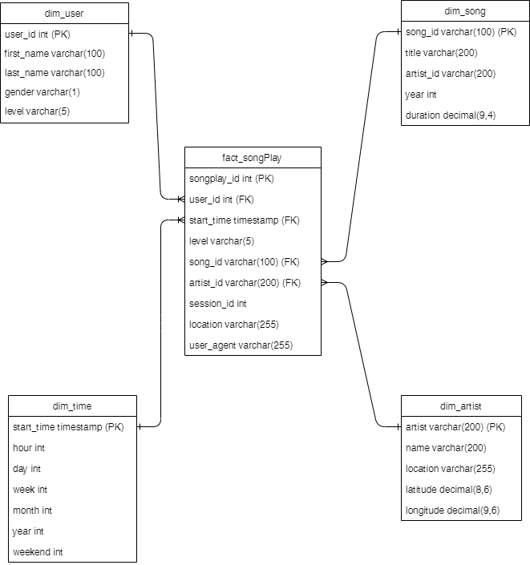

## AWS Redshift Cloud Data Warehouse - Sparkify

<br>

**Author:** Darren Foley

**Email:** darren.foley@ucdconnect.ie

**Date:** 2021-08-24

<br>

<br>

### Project Description and setup

| FileName             | Type             | Description                                      |
|---------------------:|:----------------:|:------------------------------------------------:|
| create_tables.py     | python           | Script to create tables in Redshift              |
| create_warehouse.py  | python           | Iac script to create warehouse                   |
| delete_warehouse.py  | python           | Iac script to delete warehouse                   |
| dwh.cfg              | config           | Sample configuration File                        |
| etl.py               | python           | ETL Call Script                                  |
| README.md            | markdown         | README file                                      |
| run.sh               | shell            | Shell wrapper to create and populate warehouse   |
| sql_queries.py       | python           | Script that contains all SQL                     |
| test.ipynb           | python notebook  | Test python notebook                             |
| update_git.sh        | shell            | Shell script to update local git                 |

<br>

<p>The dwh.cfg file will need to be set up before scripts can be called. Create the admin AWS user who will spin up the Redhift Cluster, add the key and secret to dwh.cfg. The endpoint and ARN user will be populated in dwh.cfg automatically when the create_database.py script is called, or you can add them manually.</p>

<br>

You can run the scripts individually like so:

```
> python create_warehouse.py
......

```

Then run the create tables

```
> python create_tables.py
.....
```

Followed by the ETL

```
> python etl.py
```

or you can run the shell wrapper run.sh like so

```
> ./run.sh
```

<br>

To destroy the Redhsift cluster run the following

```
> python delete_warehouse.py
```

<br>

<br>

### Project Outline

<br>

<p>Due to the increase in demand of sparkify services and an increase in demand for analytics within the business, sparkify have decided to move their Enterprise data warehouse to the cloud. AWS Redshift was chosen as the DWH technology of choice due to the simularity with their current on premise Postgres instance. Redshifts MPP architecture should significantly improve read performance of day to day reports and queries, provided the appropriate distribution key is chosen.</p> 

<br>

The project is broken into the following sections:

1. IaC Design
2. Table and Schema Design
3. ETL Design
4. Sample Queries/Reports

<br>

<br>

#### 1. IaC Design

<br>

<p>There are two scripts for creating and deleting the data warehouse</p>
1. create_warehouse.py
2. delete_warehouse.py

<br>

<p>These are Iac scripts written in python using the boto3 AWS client. The create script connects to AWS using the admin user, spins up the cluster and createes a role for Redshift to read from S3. Network routing is also set up so that users can connect to Redshift.</p>

<p>The delete script removes the user and warehouse so that resources are not left running.</p>

<p>This allows us to reproduce our production environment, which means testing is more accurate and reproducable.</p>

<br>

<br>

#### 2. Table and Schema Design

<br>



<br>

<p>The Data model uses a star schema identical to sparkify's existing on premise Postgres data warehouse. One major difference is the use of a distribution key which was defined in the table schema. The number of rows is quite low initially so a simple EVEN distribution key was chosen, ALL could also have been used in this case. This can be redesigned at a later stage once common query patterns are identified.</p>

<p>All of the table generation logic can be found in sql_queries.py and is called from the create_table.py script.</p>


<br>

<br>

#### 3. ETL Design

<br>

The ETL process consists of three steps:
1. Create Destination staging and schema tables.
2. Load raw json data into staging tables from buckets in S3.
3. Use INSERT INTO SELECT statements to load the destination dimension and fact tables.

<br>

<p>1. First create table statements are called by the create_tables.py script.</p>

<p>2. Next the COPY commands are called. </p>

log data is located at 's3://udacity-dend/log_data'
song data is located at 's3://udacity-dend/song_data'

<p>The COPY command will iterate through the directory hierarchy and load each file in parallel where applicable. The log data is also provided with a json path file located at 's3://udacity-dend/log_json_path.json' which helps parse out the correct fields.</p>

```
staging_events_copy = (""" 
    COPY staging_events 
    FROM {}
    IAM_ROLE '{}'
    FORMAT AS JSON {}
    REGION '{}'
""").format(LOG_DATA, ARN, LOG_JSONPATH, DWH_REGION)
```

<br>

<p>3. Finally the INSERT INTO SELECT statements load data into destination tables. Duplicates were removed from the data before loading.</p>


```
INSERT INTO fact_songPlay (
    start_time, 
    user_id, 
    level, 
    song_id, 
    artist_id, 
    session_id, 
    location, 
    user_agent
    )
    SELECT
        date_add('ms',se.ts,'1970-01-01') as start_time,
        CAST(se.userId as int) as user_id,
        se.level,
        ss.song_id as song_id,
        ss.artist_id as artist_id,
        se.sessionId as session_id,
        se.location,
        se.useragent as user_agent
    FROM staging_events se
    JOIN (
        SELECT DISTINCT
            song_id,
            title,
            artist_id,
            artist_name,
            duration
        FROM staging_songs
    ) ss
    ON se.song = ss.title
    AND se.artist = ss.artist_name
    AND se.length = ss.duration
    WHERE userId <> ' '
    ;
```
*Songplay insert statement*


<br>

<br>

#### 4. Sample Queries/Reports

<br>

1. "Top 10 users by number of sessions"

```
SELECT
    COUNT(DISTINCT fsp.session_id) as session_count,
    du.first_name,
    du.last_name,
    du.user_id
FROM fact_songPlay fsp
JOIN dim_user du
ON du.user_id = fsp.user_id
GROUP BY 
	du.first_name,
	du.last_name,
	du.user_id
ORDER BY session_count DESC
LIMIT 10
;
```

<br>

Output-->

| session_count  | first_name   | last_name    | user_id     |
|---------------:|:------------:|:------------:|:------------|
| 21             | Chloe        | Cuevas       | 49          |
| 17             | Tegan        | Levine       | 80          | 
| 11             | Kate         | Harrell      | 97          | 
| 8              | Lily         | Koch         | 15          |
| 7              | Aleena       | Kirby        | 44          |
| 7              | Mohammad     | Rodriguez    | 88          |
| 6              | Jacob        | Klein        | 73          |
| 6              | Jacqueline   | Lynch        | 29          |
| 6              | Matthew      | Jones        | 36          |
| 6              | Jayden       | Grav         | 25          |

<br>

2. "Top 10 songs by number of listens"

```
SELECT
    COUNT(fsp.song_id) as song_count,
	ds.title,
	da.name
FROM fact_songPlay fsp
JOIN dim_song ds
ON ds.song_id = fsp.song_id
JOIN dim_artist da
ON da.artist_id = fsp.artist_id
GROUP BY 
	ds.title,
	da.name
ORDER BY song_count DESC
LIMIT 10
;
```

<br>

Output-->

| song_count  | title                                                      | name                           |
|------------:|:----------------------------------------------------------:|:-------------------------------|            
| 37          | You're The One                                             | Dwight Yoakam                  |    
| 9           | I CAN'T GET STARTED                                        | Ron Carter                     |  
| 9           | Catch You Baby (Steve Pitron & Max Sanna Radio Edit)       | Lonnie Gordon                  |
| 8           | Nothin' On You feat. Bruno Mars (Album Version)            | B.o.B                          |
| 6           | Hey Daddy (Daddy's Home)                                   | Usher                          |
| 5           | Make Her Say                                               | Kid Cudi / Kanye West / Common |
| 5           | Up Up & Away                                               | Kid Cudi / Kanye West / Common |
| 4           | Mr. Jones                                                  | Counting Crows                 |
| 4           | Supermassive Black Hole (Album Version)                    | Muse                           |
| 4           | Unwell (Album Version)                                     | matchbox twenty                |